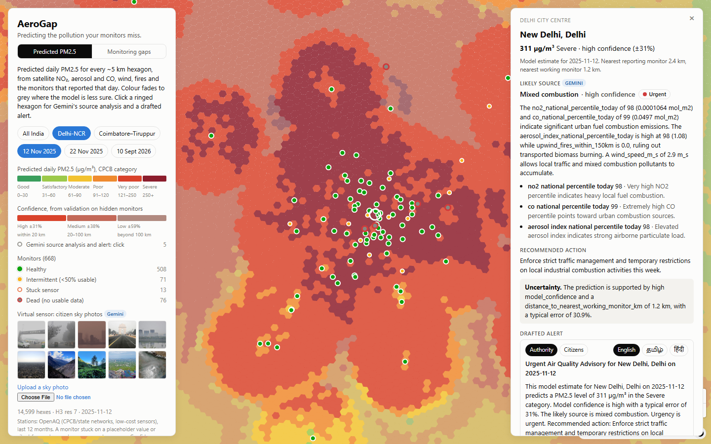

# AeroGap

> Predicting the pollution your monitors miss.

**Live map: https://mirdula18-aerogap.static.hf.space**

India runs 668 public air-quality monitors for 1.4 billion people, and 76 of them
published no usable data at all in the last year. Most of the country has never had a
station within 50 km. Where there is no monitor there is no number, and where there is
no number there is no alert, no enforcement and no evidence.

AeroGap predicts daily PM2.5 for **every ~5 km hexagon in India** — 623,207 of them —
by fusing the monitors that did report with Sentinel-5P gas columns, NASA FIRMS fire
detections and ERA5 wind. It then flags **dark zones**: hexagons where predicted
pollution is high and the nearest working monitor is far away. Gemini turns those
predictions into an attributed cause and a drafted alert in English, Tamil and Hindi.

Submission for **Code for Communities 2** (Google / GDG India): Problem Statement 02,
*Clean Air & Climate Resilience*.



## What works today

Everything below runs end-to-end and is live at the link above.

- **National grid.** H3 resolution 7, 623,207 hexagons, every one carrying its state,
  district and distance to the nearest monitor. Adding a district is a config entry.
- **Predicted PM2.5 with honest confidence.** A LightGBM model trained on 12 months of
  history, validated by hiding whole stations, with bootstrap intervals and a
  pre-registered decision rule (see below — the headline model lost, and we say so).
- **Virtual sensor.** Gemini reads a citizen's sky photo and returns a structured haze
  reading, which is folded into the grid as one low-confidence observation.
- **Source attribution.** Gemini reads a hexagon's satellite, fire and wind signals and
  names the likely dominant source, citing the signal values it used — or answers
  "insufficient signal" rather than guessing.
- **Multilingual alerts.** An authority draft and a plainer citizen draft, in English,
  Tamil and Hindi, checked to contain the predicted number and to state that it is a
  model estimate. Dispatch is mocked; nothing is sent.
- **Two cities from one config.** Delhi-NCR and Coimbatore–Tiruppur switch live on the
  map, from the same national grid and the same model.

## Architecture

```
  OpenAQ S3 archive ──┐
  CPCB data.gov.in ───┤
  NASA FIRMS ─────────┼──► ingest/ ──► Parquet ──► model/features.py ──► LightGBM
  Sentinel-5P (GEE) ──┤                (DuckDB)     one row per hex-day    model.pkl
  ERA5-Land wind ─────┘                                                        │
                                                                               ▼
                    web/ (React + MapLibre + deck.gl)  ◄── static JSON ◄── model/predict.py
                              │                                                │
                              └──► gemini/ ──► utils/llm_cache.py ◄────────────┘
                                   photo_sensor · attribute · alert
                                   (every call cached to disk)
```

No billing account is involved anywhere: DuckDB and Parquet instead of BigQuery, a
local LightGBM `.pkl` instead of Vertex AI, MapLibre instead of Google Maps Platform,
and a free static host. Gemini runs on an AI Studio free-tier key.

## What the model can and cannot do

Validation hides **entire stations**, never random rows, so the score answers the
question that matters: how well does this work where there is no monitor? Intervals
come from a station-level bootstrap (2,000 draws), so a station's many correlated days
cannot masquerade as independent evidence.

| Distance to nearest monitor | MAE µg/m³ | Improvement over IDW baseline | Verdict |
|---|---|---|---|
| 0–20 km | 16.8 [15.8, 17.8] | −3.8% [−5.8, −1.7] | IDW is better; plenty of nearby data |
| 20–50 km | 18.6 [16.4, 21.0] | **+12.1% [+6.8, +17.0]** | Real improvement |
| 50–100 km | 15.0 [13.4, 17.0] | **+7.3% [+1.5, +12.6]** | Real improvement |
| 100 km+ | 21.4 [16.5, 28.3] | +6.9% [−7.7, +21.4] | **Cannot be demonstrated** |

**The honest claim: within 100 km of a working monitor, AeroGap beats interpolation by
7–12% with intervals that hold. Beyond 100 km we cannot demonstrate an improvement, and
we say so on the map.** The confidence band shown to a user is the measured relative
error for their distance: ±31% within 20 km, ±38% from 20–100 km, ±59% beyond 100 km.
Colour fades to grey as confidence falls.

The decision rule was **written down and committed before the evaluation ran**
([docs/model-decision.md](docs/model-decision.md), commit `142d1eb`). The pre-registered
combined model failed its own test at 100 km+, so the simpler variant was promoted
instead. That result is published rather than quietly rerun.

Full tables: [docs/model-bands-ci.md](docs/model-bands-ci.md),
[docs/latlon-ablation.md](docs/latlon-ablation.md),
[docs/sidco-kurichi-ci.csv](docs/sidco-kurichi-ci.csv).

## Gemini, and why it is load-bearing

Three jobs, none of them decorative. Remove Gemini and the product loses its input in
unmonitored areas, its explanation and its output.

| Module | Input | Output |
|---|---|---|
| [gemini/photo_sensor.py](gemini/photo_sensor.py) | A citizen sky photo | Haze 0–100, visibility, likely source, confidence → a PM2.5 band, fused into the grid by inverse variance as a low-confidence observation |
| [gemini/attribute.py](gemini/attribute.py) | One hexagon's satellite, fire, wind and monitor signals | Dominant source, cited evidence, recommended action, urgency, explicit uncertainty statement |
| [gemini/alert.py](gemini/alert.py) | The attribution plus the prediction | Authority and citizen alerts in English, Tamil and Hindi |

**Grounding is enforced, not hoped for.** Schema-constrained JSON; the model may cite
only signal names present in its input, and citations are checked afterwards; missing
data must produce `insufficient_signal`, not a guess; every drafted alert is checked to
contain the predicted number in all six texts. Known remaining weaknesses, including two
cases where the free-text reasoning is unsupported, are written up in
[docs/gemini-notes.md](docs/gemini-notes.md) rather than hidden.

**Every call is cached to disk** by a hash of model, prompt version and request body
([utils/llm_cache.py](utils/llm_cache.py)). `AEROGAP_GEMINI_OFFLINE=1` refuses to touch
the network at all. The demo and the recorded video replay from that cache with **zero
API calls**, so a rate limit or an outage cannot break a live presentation — which
matters, because the free tier allows 20 requests per day per model and spent a whole
evening returning "high demand".

## Run it

```bash
python -m venv .venv && .venv\Scripts\activate    # Linux/macOS: source .venv/bin/activate
pip install -r requirements.txt
cp .env.example .env                               # then fill in your keys
```

Replay the whole Gemini layer offline, with no key and no network:

```bash
AEROGAP_GEMINI_OFFLINE=1 python -m gemini.attribute     # source attribution, 3 demo dates
AEROGAP_GEMINI_OFFLINE=1 python -m gemini.alert         # multilingual alerts + mock dispatch
AEROGAP_GEMINI_OFFLINE=1 python -m gemini.photo_sensor  # 10-photo virtual-sensor corpus
```

The map:

```bash
cd web && npm install && npm run dev        # reads the static JSON in web/public/data
```

Rebuild the pipeline from scratch (needs keys and several hours):

```bash
python -m ingest.openaq                     # 12-month national corpus -> Parquet
python -m ingest.gee --start ... --end ...  # Sentinel-5P + ERA5 wind per hex-day
python -m ingest.firms --start ... --end ...# active fires per hex-day
python -m model.grid                        # national H3 grid + distance to monitors
python -m model.features                    # one row per hex-day
python -m model.train                       # leave-station-out CV
python -m model.predict                     # daily PM2.5 for the map
```

## Repo layout

| Path | What it holds |
|---|---|
| [ingest/](ingest/) | `openaq.py` (training corpus), `cpcb.py` (live snapshot), `firms.py` (fires), `gee.py` (Sentinel-5P + wind) |
| [model/](model/) | `grid.py`, `features.py`, `train.py`, `validate.py`, `bootstrap.py`, `decide.py`, `predict.py`, `model.pkl` |
| [gemini/](gemini/) | `photo_sensor.py`, `attribute.py`, `alert.py`, `common.py` |
| [utils/](utils/) | `llm_cache.py` — the disk cache every Gemini call goes through |
| [api/](api/) | FastAPI service and `export_static.py`, which snapshots its responses for static hosting |
| [web/](web/) | React + MapLibre GL + deck.gl hex layer |
| [docs/](docs/) | Validation tables, the pre-registered decision, Gemini findings, screenshots |

## Ingestion: two sources, two jobs

| | `ingest/openaq.py` | `ingest/cpcb.py` |
|---|---|---|
| **Role** | Model **training** corpus | **Live** layer on the map |
| **Source** | [OpenAQ open data archive](https://docs.openaq.org/aws/about) on S3 | [CPCB real-time AQI](https://data.gov.in/resources/real-time-air-quality-index-various-locations) via data.gov.in |
| **Time span** | Months to years of hourly history | The current reading only |
| **Values** | Raw concentrations, with explicit units | CPCB figures (sub-index vs concentration still to be confirmed, see below) |
| **Access** | Anonymous, unsigned HTTPS. No account, key or AWS credentials | Needs `DATA_GOV_IN_API_KEY` |
| **Reliability** | Static files, about a 3-day lag | Frequent 502 outages. Run it opportunistically |

**Why the split:** the data.gov.in resource returns only a *current snapshot*. You can't train a spatial interpolation model on a single timestamp, because it needs readings across many stations over many months. OpenAQ archives that history. CPCB stays as the freshest real-time signal for the map.

The corpus behind the shipped model: **668 stations, 146.2M readings, 2025-09-13 to 2026-09-10**.

### Historical corpus (OpenAQ)

```bash
# small test slice first: one month, one state
python -m ingest.openaq --start 2026-08-01 --end 2026-08-31 --states Delhi

# full default: India, last 12 months
python -m ingest.openaq

# widen or narrow later
python -m ingest.openaq --start 2024-01-01 --states "Delhi,Haryana,Uttar Pradesh"
python -m ingest.openaq --skip-download          # rebuild Parquet from the local cache only
```

The pipeline has four steps:

1. **Discover.** The archive's record files have no country or state fields, and its `provider=/country=` tree is a frozen legacy copy (India's CPCB providers stop in 2022). So every location ID is probed once for its years and coordinates. The first run covers about 55k locations and takes roughly an hour. Results are cached in `data/raw/openaq/<snapshot>/locations_probe.jsonl`, and interrupted runs resume where they stopped.
2. **Geolocate.** Stations get a state (ADM1) and district (ADM2) by point-in-polygon against [geoBoundaries](https://www.geoboundaries.org/). Anything outside the country's boundaries is dropped, which is how the country filter works.
3. **Download.** The script mirrors the daily `.csv.gz` files to `data/raw/openaq/<snapshot>/records/`. A file already on disk with the size S3 reports is never downloaded again.
4. **Build.** Rows are cleaned and written month by month.

Output is `data/history/state=<state>/parameter=<p>/month=<YYYY-MM>/part-0.parquet`, in a long schema:

| column | notes |
|---|---|
| `station_id` | `openaq-<location_id>` |
| `station_name`, `lat`, `lon` | as reported by OpenAQ |
| `city` | ADM2 **district** containing the station (the archive has no city field) |
| `state` | ADM1 state/UT, ASCII-folded (`Tamil Nadu`) |
| `parameter`, `value`, `unit` | native units, normalised spelling (`ug/m3`, `ppm`, `ppb`) |
| `timestamp_utc` | UTC; marks the **end** of the averaging period |

**Cleaning:** the script drops rows with null values, bad timestamps, missing coordinates, negative values, sentinels (`999`, `9999`, …), physically implausible readings, and duplicate sensor-timestamp pairs. Each run logs how many rows it dropped for each reason. It also writes `data/history/_summary.json` (stations, date range, rows per parameter, states covered, unit and value ranges) and `_stations.parquet`.

**Partitions:** each partition always contains every cached day of its month, so a narrow re-run (one state, part of a month) can't overwrite data from a wider one.

**Bad data is flagged, never deleted.** A sensor stuck on one value for over 24 hours keeps its rows and gains a `quality_flag`; filtering happens at read time. Station health (healthy / intermittent / stuck / dead) is shown on the map, and dead monitors are one of the findings the model has to work around: 76 of 668 stations published nothing usable.

### Live snapshot (CPCB)

```bash
python -m ingest.cpcb                 # replay the latest cached snapshot, or pull if none
python -m ingest.cpcb --refresh       # force a live pull from data.gov.in
```

| File | Contents |
|---|---|
| `data/raw/cpcb/<timestamp>/page_*.json` | Raw API pages, the on-disk cache |
| `data/cpcb/readings_<timestamp>.parquet` | Long format: one row per station × pollutant |
| `data/cpcb/stations_<timestamp>.parquet` | Wide format: one row per station, with pollutant columns and the computed NAQI |
| `data/cpcb/stations_latest.parquet` | Copy of the most recent stations snapshot |

### Units: findings, and the reconciliation still to build

These findings come from a test run on Delhi for August 2026: 51 stations and 1.13M rows. OpenAQ's Indian government-station series come from the same CPCB network as data.gov.in, and several of their **unit labels are wrong**:

| parameter | OpenAQ label | observed p5 to p95 | what the values actually are |
|---|---|---|---|
| `co` | ppb | 0.24 to 2.15 | **mg/m³**, CPCB's native CO unit. Outdoor CO around 1 ppb is physically impossible |
| `no`, `no2` | ppb | 1.5 to 39, and 4.1 to 59 | **µg/m³** (proven by the NOx check below) |
| `nox` | ppb | 0.01 to 0.05 | **ppm** (proven by the same check) |
| `so2` | ppb | 1.1 to 28.5 | probably µg/m³, since it comes through the same pipeline, but not proven |
| `o3`, `pm25`, `pm10` | µg/m³ | as expected | µg/m³, correctly labelled |

**NOx check:** across 101,438 hourly rows, NOx×1000 equals NO + NO2 converted from µg/m³ to ppb. The median ratio is 1.000, and the middle half of rows falls between 0.998 and 1.002. Reading NO and NO2 as ppb instead gives a median ratio of 0.60.

Two reconciliation layers are needed before any feature engineering. **Neither is built yet:**

1. **OpenAQ unit correction:** relabel or convert the government-station series above. Low-cost sensors in the corpus, such as PM2.5-only community monitors, need a separate sensor-class flag.
2. **CPCB data.gov.in reconciliation:** the live feed is believed to publish per-pollutant **sub-index** values rather than concentrations, but that hasn't been confirmed, because data.gov.in has been returning 502s. Both sources use identical station names (for example, `Anand Vihar, Delhi - DPCC`), so the test is to join them on station and hour and compare. If the values turn out to be sub-indices, convert them using the CPCB NAQI breakpoints.

`ingest/openaq.py` stores values **exactly as published** (native units, original labels). Corrections belong in the feature layer, where they can be tested and reversed.

## Data sources

| Source | Use | Licence |
|---|---|---|
| [OpenAQ archive](https://openaq.org/) | Historical station readings (training) | CC BY 4.0 (per-provider terms apply) |
| [CPCB real-time AQI via data.gov.in](https://data.gov.in/resources/real-time-air-quality-index-various-locations) | Live station readings | GODL-India |
| [geoBoundaries](https://www.geoboundaries.org/) IND ADM1 / ADM2 | State and district assignment | CC BY 2.5 IN / ODbL |
| [NASA FIRMS](https://firms.modaps.eosdis.nasa.gov/) | Active fire detections | Open |
| Sentinel-5P TROPOMI via Google Earth Engine | NO2, CO, SO2 columns, aerosol index | Copernicus open |
| ERA5-Land via Google Earth Engine | Wind vectors | Copernicus open |

Demo photographs are Wikimedia Commons images under CC BY-SA or public domain, credited
individually in [web/public/data/photos/CREDITS.md](web/public/data/photos/CREDITS.md).

## Digital public good and privacy

- **Open licence:** MIT for code, CC-BY 4.0 for data and documentation.
- **Open standards:** H3, GeoJSON, Parquet, OpenAPI.
- **No personal data.** Uploaded photos are re-encoded to strip EXIF (location, device,
  timestamp) before anything is sent to Gemini or stored. On the deployed map, an
  uploaded photo never leaves the browser at all: it is hashed locally and matched
  against cached results. No account, no login, no tracking.
- **DPDP Act 2023 basics, in the interface.** A notice appears above the upload control
  before any photo is chosen, stating what is collected, that location is kept only as a
  ~5 km hexagon, and that the photo is used to estimate haze and nothing else. Any
  reading a citizen contributes can be withdrawn from the map with one click.
- **Alerts address roles, never people** — "District Collector, Kargil" — and are never
  actually dispatched in this build.
- **Do no harm:** every prediction carries a confidence band; low-confidence areas fade
  to grey; low-confidence alerts recommend verification, never enforcement; and no
  prediction is ever attributed to an individual or a specific property.

## Limitations

Stated plainly, because a tool that overstates its accuracy is worse than no tool.

- Beyond 100 km from a working monitor, the improvement over simple interpolation
  **cannot be demonstrated** with this data. The prediction is still shown, at ±59%, in
  grey.
- Within 20 km of a monitor, plain interpolation is slightly better than the model.
- Photo-derived PM2.5 is an **uncalibrated** mapping from haze to a wide band, not a
  measurement, and is treated as one noisy low-confidence vote.
- Gemini's source attribution is a plausible reading of the signals, not a source
  apportionment study. Known failure cases are listed in
  [docs/gemini-notes.md](docs/gemini-notes.md).
- The live CPCB feed is not yet reconciled with the training corpus (see units, above).
- Predictions are daily, not hourly, and the map ships three fixed demo dates rather
  than a live feed, because re-running the satellite export costs Earth Engine quota.

## Licence

Code: [MIT](LICENSE). Data and docs: CC-BY 4.0.
