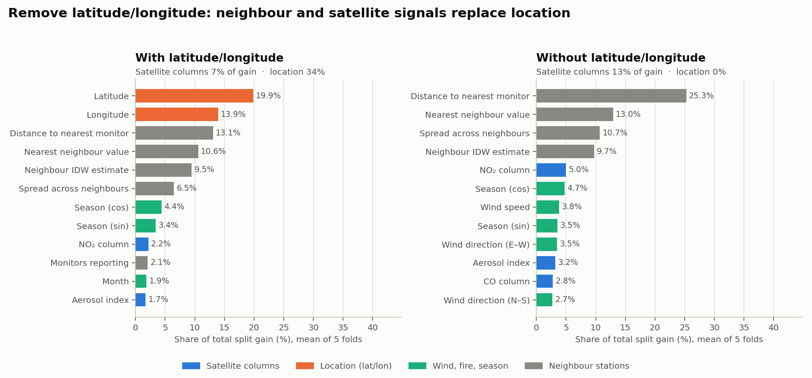

# Lat/lon ablation: is the model more than a map of where pollution usually is?

Same model (residual on the neighbour IDW estimate, squared loss, same folds and seed), trained twice: once with latitude/longitude, once without. If it were only memorising that some places are polluted, removing location would hurt everywhere.

**What the evidence supports:** removing location does not hurt the 20-100 km bands (the paired table below says whether it measurably helps). Location's share of the model's gain is replaced by neighbour-station features first and satellite columns second: satellite share rises from 7% to 13% of total gain. The 100 km+ band, where there are no neighbours to lean on, gets worse.

**What it does not support:** that the satellite columns dominate. By gain they are a minority signal; the neighbour stations carry most of it. Ranking by split count (how often a feature is used) overstates the satellite columns and should not go on a slide.

Per-row intervals: station bootstrap, 2,000 draws; SIDCO: 7-day block bootstrap.

| Same model (residual on IDW) | Top 3 features by gain | Satellite share of gain | 0-20 km vs IDW [95% CI] | 20-50 km vs IDW [95% CI] | 50-100 km vs IDW [95% CI] | 100 km+ vs IDW [95% CI] | SIDCO Kurichi MAE [95% CI] |
|---|---|---|---|---|---|---|---|---|
| **With lat/lon** | Latitude 20%, Longitude 14%, Distance to nearest monitor 13% | 7% | -6.3% [-9.1, -3.4] | +9.6% [+3.7, +15.1] | +4.4% [-1.9, +10.3] | -0.3% [-13.1, +10.8] | 11.5 [9.3, 14.0] |
| **Without lat/lon** | Distance to nearest monitor 25%, Nearest neighbour value 13%, Spread across neighbours 11% | 13% | -3.8% [-5.8, -1.7] | +12.1% [+6.8, +17.0] | +7.3% [+1.5, +12.6] | -7.5% [-19.6, +1.3] | 9.7 [8.1, 11.6] |

## The paired test

Two overlapping per-model intervals cannot say whether one model beats the other. This compares them on the same station bootstrap draws:

| Band | Station-days | Without vs with lat/lon: MAE improvement [95% CI, paired] | Removing lat/lon clearly helps? |
|---|---|---|---|
| 0-20 km | 95,684 | +2.4% [-0.0, +4.7] | not established |
| 20-50 km | 18,474 | +2.7% [-0.3, +5.8] | not established |
| 50-100 km | 23,396 | +3.0% [+0.3, +5.8] | yes |
| 100 km+ | 5,033 | -7.1% [-14.4, -0.9] | worse |

